Previous: [1. Load data files](load_data.md)

---

# 2. Extract electrical properties

This page guides you through the electrical properties measurements in the `extract electrophysiological properties` panel, where you can read, process, and visualize the selected recordings in a file-by-file manner. 

:bulb: Settings in white boxes; results in grey boxes.

:bulb: In ElecFeX, get your tips by moving the cursor to the text.

[2.1 - Data Info](#21-data-info)  
[2.2 - Input Resistance](#22-input-resistance)   
[2.3 - Amplitude & Area](#23-amplitude--area)  
[2.4 - Spike Detection](#24-spike-detection)   
&emsp;  [2.4.1 - ADC steady state](#241-adc-steady-state)   
&emsp;   [2.4.2 - For the hyperpolarizing sweep](#242-for-the-hyperpolarizing-sweep)  
&emsp;   [2.4.3 - Spike detection](#243-spike-detection)  
[2.5 - Spike Properties](#25-spike-properties)  
[2.6 - Visualization](#26-visualization)  

---
## 2.1 Data Info

The first subpanel contains basic information in the file. 

**Setting.** Choose one ADC (analog-to-digitcal conversion) and/or DAC (digitcal-to-analog conversion) channel (or one protocol). You can also change the ADC (acquisition) offset.

1. **”Select one file” dropdown box.** It contains a list of selected file. Specify one file to read and visualize.

>:bulb: 
>The first time loading a NWB file, a warning dialog may appear and request you to modify the configuration of the NWB file. See <a href='#NWBconfig'>NWB config</a>. 

2. **“ADC channel (acquisition)” and “DAC channel (acquisition)” dropdown box.** Select the channel of ADC and DAC signals to read. 
   + ADC channels record signals from the cells and DAC channels are the digital signal  applied to the cells. E.g., in a current clamp recording, ADC channels are the recorded voltage response and DAC channels are the applied current stimuli.
   + **ABF files.** The word “ADC channel” and “DAC channel” are inherited from the protocol settings of ABF files. 
   + **NWB files.** Customized in `NWB config`. It specifies the procotol names, and both ADC and DAC channels are the same.
   + **IBW files**. Both ADC and DAC channels are the file name.
3. **ADC offset.** Correct the value of ADC (acquisition) signal by adding up an offset value. One example is to perform voltage correction for the liquid junction potential or the offset voltage of the pipette.

**Measurement.** The information on recordings from the selected protocol is shown, including:

1. **File format.** The data file format and its version: 2nd version of **Axon Binary File (ABF) format (ABF)** from pClamp data acquisition program,  **Igor Binary Wave (IBW)** from Igor Pro, and **Neurodata Without Border (NWB)**.
2. **Acquisition Mode.** The data acquisition mode.
   + **ABF files.** (1) Event-driven, variable length, (2) Event-driven, fixed length, (3) Gap-free, (4) High Speed Oscilloscope, (5) Episodic Stimulation. For a detailed description on each acquisition mode, see [pClamp User Guide](https://neurophysics.ucsd.edu/Manuals/Axon%20Instruments/pCLAMP10-User-Guide-RevA.pdf).
   + **IBW files.** The name of ADC/DAC channel
   + **NWB files.** Customized in `NWB config`. It specifies the stimulus attribute, such as “VoltageClampSeries” or “CurrentClampSeries”.
3. **Sampling rate (kHz).** The data acquisition sampling rate.
4. **Time interval ($\mu$s).** The time interval of sampling data. It is the inverse of sampling rate.
5. **Sweep number.** The total number of sweep(s).
6. **ADC dataunit.** The unit of ADC (acquisition) signal.
7. **DAC dataunit.** The unit of DAC (stimulus) signal.

>:bulb: 
> Following the data loading, the unit of each electrical features are also updated and displayed as combination of the `ADC dataunit` (i.e., acquisition unit, or AU) and the `DAC dataunit` (i.e., stimulus unit, or SU). For instance:
> + the unit of <code>input resistance</code>. is shown as AU/SU; 
> + the unit of <code>estimated capacitance</code> is shown as the SU/AU*msec.
> + the unit of <code>area</code> is shown as AU*msec.  
>
> Users may transform these unit combinations into their commen forms:
> + volt/amp = &#937;
> + amp/volt*sec = F
>
> Following batch analysis, the ADC dataunit and DAC dataunits for each file are provided in the result table. The table row names (or column names) showing the name of electrical features also include units in the form of a combination of AU and SU.

8. **NWB config.** Click the `NWB config` button and a dialog will open. Here, users need to specify the configuration of their NWB files, including the locations for the data, dataunit, protocol names, sampling rates, acquisition modes, and the sweep numbers of the acquisition and the stimulus.

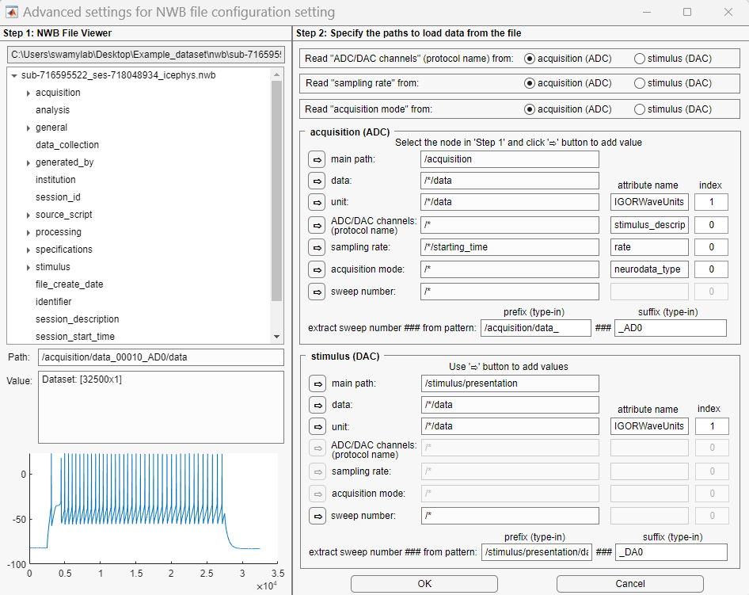

+ **Step 1: NWB File viewer.** This panel load the NWB file you choose in the main panel. It expands the structure of the NWB file (see [Intro to NWB](https://nwb-overview.readthedocs.io/en/latest/intro_to_nwb/1_intro_to_nwb.html) for details). Click the node,  its path, value, and visualization (if it is a dataset) will be display at the lower panel.
+ **Step 2: Specify paths of multiple data information for loading the NWB file.** Several data information to be loaded are required to have their paths specify. Use the right-arrow buttons to add the path and the attribute name. 
   + A NWB file usually contains groups named "acquisition" and "stimulus". Use the button groups to determine whether the protocol name, sampling rate, and the acquisition mode is read from the acquisition group or the stimulus group.
   + Next, for both acquisition and stimulus, use the rightarrow buttons to specify the path and attribute name (if any) for the data, unit, protocol name, sampling rate, acquisition mode, and sweep number.  

      >:bulb: 
      >You CANNOT keyboard-edit the "path" and "attribute name" textbox. Only use the button to change their values. When more than 1 value is in an attribute, you CAN keyboard-edit the index value to specify the which attribute value to read.    
      
   + Usually the sweep number is embedded in a string. Keyboard-edit the prefix and the suffix to extract sweep numbers from the string. For instance, sweep numbers in the example figure is embedded in the subgroup name "data_XXXXX_AD0" for the acquisition group. To get the sweep number, type-in the prefix ""data_" and the suffix '_AD0'.

## 2.2. Input Resistance

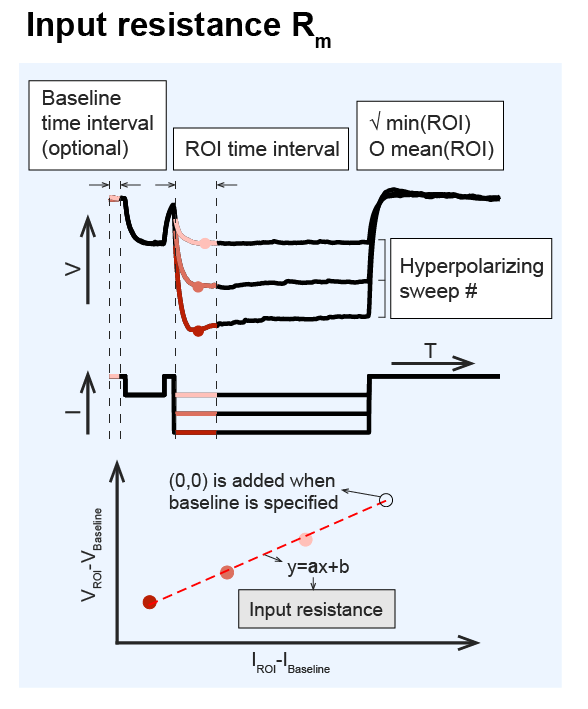

**Input resistance.** Input resistance is defined as the slope of a linear fit of the voltage against the hyperpolarizing current. It provides as a readout of the pipete seal quality, the conductance of the ion channels at the resting state, and how much the membrane potential can depolarize in response to a stimulation. 

The voltage is sampled at where a hyperpolarizing step current is applied. It is worth-noting that the existance of **hyperpolarization-activated cation current (Ih)** can gradually lift up the membrane potential during the hyperpolarization and forms a "voltage sag". Whether to exclude the effect of Ih depends on if the voltage samples at the initial peak or the later steady state. 

**Measurement.** The gray textbox `Input resistance` measures the slope of linear fit of DAC against ADC signals. To be specific, it fits $(x,y)=(DAC_{ROI}-DAC_{baseline}, ADC_{ROI}-ADC_{baseline})$ to a linear function $y=ax+b$ using MATLAB `polyfit()` and the estimated slope $a$ is assigned to input resistance. 

If the baseline is NOT specified, $\geq 2$ hyperpolarizing sweeps are required for a linear fit; otherwise, the linear curve is assumed to cross $(0,0)$ and $\geq 1$ hyperpolarizing sweep is required.

**Setting.** To measure the input resistance, you need to specify the parameter settings below:

1. **Hyperpolarizing sweeps #.** The sweep range indexes. For measuring the input resistance, specify the index range for hyperpolarizing step currents.
   > + [left box] and [right box] must be positive integer
   > + [left box] must be smaller than or equal to [right box]

2. **Baseline time interval (optional)**. It specifies the time interval of the baseline of ADC and DAC signals. The baseline is where DAC is zero and ADC is at resting state. The baseline value will be corrected from the ROI values. If the parameter is not specified here, the baseline value is assumed to be 0; otherwise, the baseline value is measured as the average in-between the specified baseline time interval.

   > + [left box] and [right box] must be positive and within the range of sweep duration
   > + [left box] must be smaller than or equal to [right box]

3. **ROI time interval**. It specifies the time interval to sample the ADC and DAC signals for linear fitting.

   > + [left box] and [right box] must be positive and within the range of sweep duration
   > + [left box] must be smaller than or equal to [right box]

4. **min(ROI) v.s. mean(ROI).** Click the button to determine whether to get the minimal value or the mean value of the ADC and DAC signals within the ROI time interval.

> + Choose "min(ROI)" when sampling from the initial voltage peak. This is to exclude the effect of [hyperpolarization-activated current](#Ih). 
> + Choose "mean(ROI)" when sampling from the voltage steady state. 

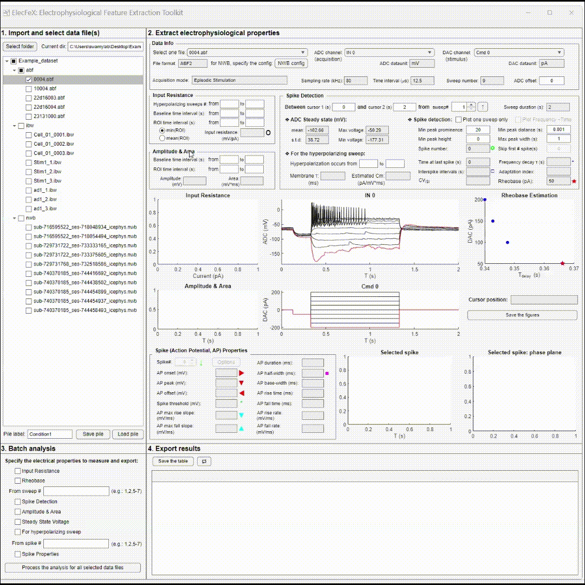

## 2.3. Amplitude & Area

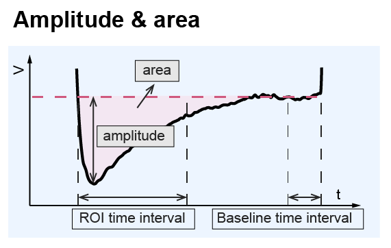

**Amplitude & Area.** Many electrical features are quantified by their amplitude and area, e.g., **voltage sag** and **after-hyperpolarization potential (AHP)**. Voltage sag is the voltage deflection from the steady state to the peak in response to a hyperpolarizing current. It is an indicator of hyperpolarization-activated current $I_h$. AHP is the hyperpolarized voltage change after the excitation. It is classified into slow, medium, and fast based on their time decay rate [1,2,3](#Reference) and is indicator to many ion channels' activity, e.g., the calcium-activated potassium channels[4](#Reference).

**Measurement.** The `amplitude` measures from the peak to the baseline (averaged ADC signal within the baseline time interval; or 0 if baseline not specified). The `area` measures the area under the curve $[\sum (ADC_{ROI}-ADC_{baseline})]\cdot dt $ between the ADC signal and the baseline.

**Setting.** To measure the amplitude and the area, you need to specify several parameter settings (in the white textboxes):

1. **Baseline time interval (optional)**. It specifies the time interval of the baseline (or offset) ADC signal to be removed from the ROI signal. These two boxes are optional to set. If specified, the baseline value is the average in between the specified baseline time interval; otherwise, the default baseline value is 0.

   > + [left box] and [right box] must be positive and within the range of sweep duration
   > + [left box] must be smaller than or equal to [right box]

2. **ROI time interval**. It specifies the time interval of ADC signal to measure the amplitude and area. The ROI signal is in between the specified ROI time interval. 

   > + [left box] and [right box] must be positive and within the range of sweep duration
   > + [left box] must be smaller than or equal to [right box]

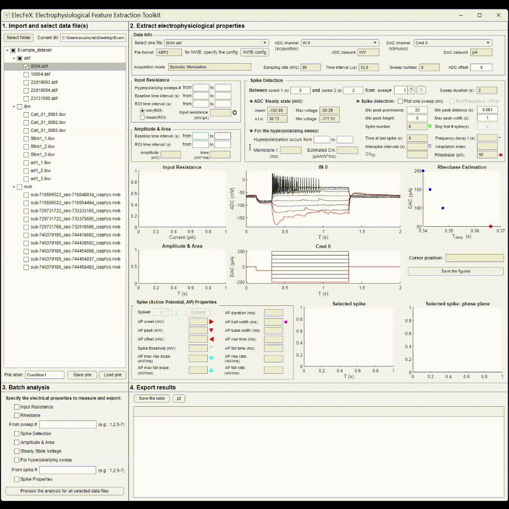

## 2.4. Spike Detection

**Measurement.** Several measurements on specified sweep and within specified time interval of the recording is performed, including:

[2.4.1 ADC steady state](#241-adc-steady-state)  
[2.4.2 For the hyperpolarizing sweep](#242-for-the-hyperpolarizing-sweep)  
[2.4.3 Spike detection](#243-spike-detection)  

**Setting.** Here you need to specify the `sweep#` and the time interval `cursor 1` and `cursor 2`.

1. **Cursor 1 (s) and Cursor 2 (s)**.The time interval to perform the measurements. In the visualization panel, the signals outside the cursors are plotted in gray.

   > + [left box] and [right box] must be positive and within the range of sweep duration
   > + [left box] must be smaller than or equal to [right box]

2. **Sweep#**. The specific sweep of the ADC signal to perform the measurements. In the visualization panel, the signals of specified sweep is plotted in red while other sweeps are in black.

3. **$\uparrow$ button**. Click this button and flip the sweep order. The upward arrow button is the same sequence as in the data file and the downward arrow button is the opposite.

### 2.4.1 ADC steady state

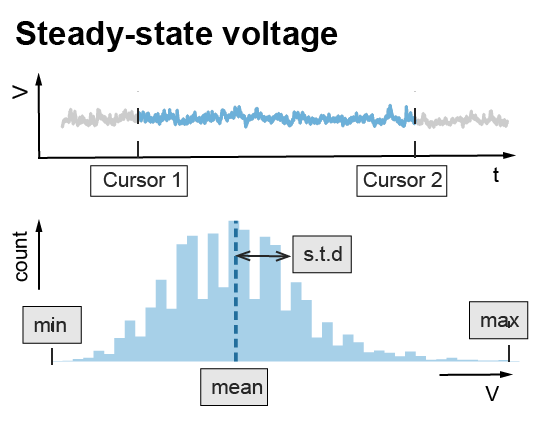

**Measurement.** This part measures quantify the (1) mean, (2) standard deviation (s.t.d.), (3) max, and (4) min value of the ADC signal between the cursors. This method can be used to measure the **resting membrane potential** when there is no current injection.

### 2.4.2 For the hyperpolarizing sweep

**Measurement.** This method estimates the membrane constant and the membrane capacitance from the hyperpolarizing step sweep. It fits the hyperpolaring voltage to a single exponential equation $y=a\cdot exp(x/\tau)$ where the exponential decay constant was estimated as the **membrane time constant ($\tau$)**.  If the input resistance $R_m$ is set and measured in [2.2. Input Resistance](#22-input-resistance), the **membrane capacitance** $C_m$ is estimated as $C_m=\frac{\tau}{R_m}$.

> :bulb:<b>How the membrane time constant and capacitance is estimated?</b>  
> The equation describing the membrane voltage V in response to a hyperpolarizing current injection Iapp
>

 
> Assume the initial condition is at the resting steady state (V=E), the temporal solution of the voltage is
>

 
>and the time constant of the voltage &tau;=C&times;Rm, where C is the membrane conductance and Rm is the membrane input resistance. Notice that these values are independent to the value of injected current.

**Setting.** To measure the membrane constant and capacitance, you need to specify:

1. **Time interval (s).** It specifies the time interval from when the voltage starts to hyperpolarize to when the voltage reaches the steady state. 

   > + [left box] and [right box] must be positive and within the range of sweep duration
   > + [left box] must be smaller than or equal to [right box]

### 2.4.3 Spike detection

**Measurement.** This panel detects spikes of ADC signals between the cursors and quantify the time series of the spike train. 

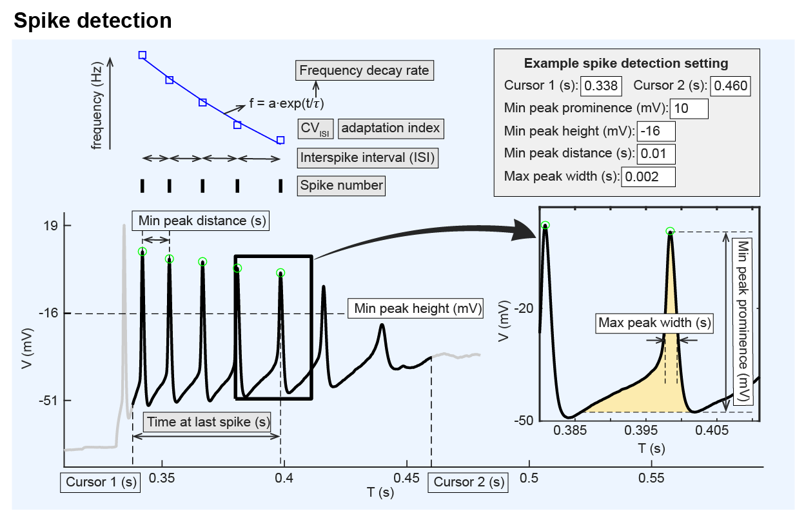

**Setting.** Spike detection in ElecFeX relies on the MATLAB built-in function `findpeaks()` from the *Signal Processing Toolbox*. The definitions of the parameters are consistent to those described in the [Mathwork-findpeak()](https://www.mathworks.com/help/signal/ref/findpeaks.html). To be specific, you need to specify the parameter settings in the white textboxes and checkboxes as introduced below:

1. **Min peak prominence (mV).** It specified the minimal value for the peak prominence. The peak prominence refers to the peak amplitude relatives to its local minimal. For details: [`findpeaks()`-Prominence](https://www.mathworks.com/help/signal/ref/findpeaks.html#buff2uu)
2. **Min peak height (mV)**. It specifies the minimal value for spike height (i.e., the value of the spike peak).
3. **Min peak distance (s)**. When you specify a value for 'Min peak distance', the algorithm chooses the tallest peak in the signal and ignores all peaks within 'Min peak distance' of it. The function then repeats the procedure for the tallest remaining peak and iterates until it runs out of peaks to consider.
4. **Max peak width (s)**. It specifies the maximal widths of spikes.
5. **Skip first # spike(s)**. Skip the first # spikes to perform the measurements on spike train properties (interspike intervals, CVISI, frequency decay rate, and adaptation index) and spike properties.

There are another two checkboxes for the visualization:

1. **Plot one sweep only checkbox**. If checked, only the sweep specified by “Sweep #” spinner box will be plotted while signals of other sweeps are hidden.
2. **Plot Frequency (Hz) v.s. Time (s) checkbox**. If checked, instantaneous firing frequencies and their single exponential fitting curve is plotted in the visualization. This checkbox is only accessible when more than 3 spikes are detected.

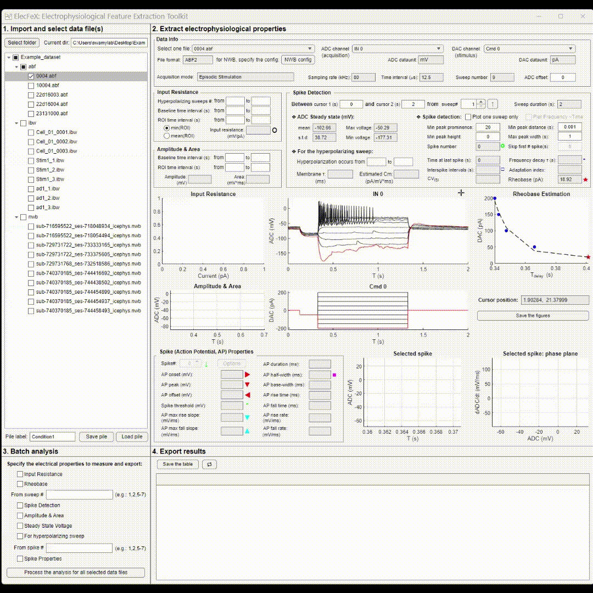

**Spike train properties.** In the visualization panel, the detected spikes are marked by green circles. The spike trains properties include:

1. **Spike number.** The total number of detected spike(s) between cursor 1 and cursor 2.
2. **Time at last spike (s).** The time difference between the “Cursor 1 (s)” textbox and the timepoint at the last spike peak. It can be used to measure **discharge duration**.
3. **Interspike intervals (s).** The list of time interval(s) between every two adjacent spikes.
4. **CVISI**. It measures the unbiased standard deviation of interspike intervals (ISIs) divided by the mean ISI.
5. **Frequency decay rate**. It measures the time constant when the instantaneous firing frequencies are fitted to a single exponential decay function $f=a\cdot exp(t/\tau)$.
6. **Adaptation Index**. The normalized average difference of two consecutive interspike intervals. 
   $$adaptation\ index = \frac{1}{N-1} \sum_i \frac{ISI_{i+1}-ISI_{i}}{ISI_{i+1}+ISI_{i}}$$

### 2.4.4 Rheobase

**Measurement.** In theory, rheobase is the minimal step current that is injected for an infinite time and evokes a single action potential. However, to measure the rheobase in that way is technically impossible. Another way is to estimate the rheobase using the computational model of the neuron, which is, on the other hand, not usually available. To find a close approximation of the rheobase, we provided three methods.

**Setting.** The spike detection will be performed between the cursors but for all the sweeps. To select the estimation method, move your cursor to the `rheobase` gray text box and right-click, an option window will appear.

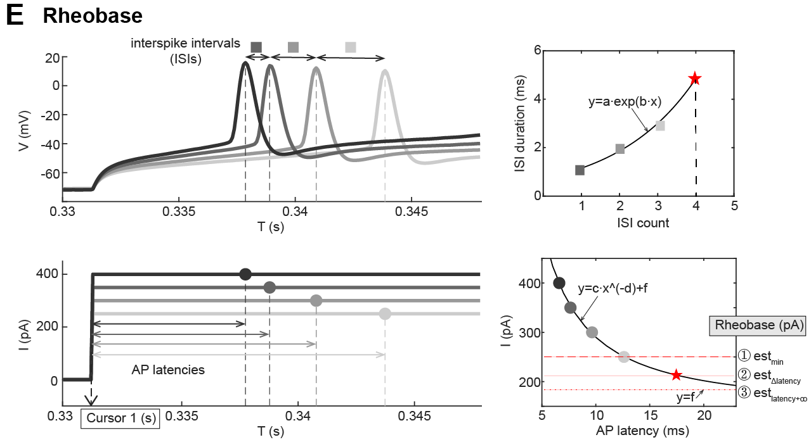

1. **The minimal applied current eliciting a spike $est_{min}$**. This method estimates the rheobase as the minimal applied current in your protocol that elicits at least one spike. It is appliable when you used a step current protocol of (1) small step size, (2) current that does not trigger firing (i.e., possibly lower than the rheobase). 

2.  **The lower asymtote of the 1st spike time latency curve $est_{latency+\infty}$**. This method  performs a power function $I_{app}=a\cdot t_{delay}^b$ curve-fit that plots the applied currents against the 1st spike time latency. The lower asymptote $I_{app}=b$ is estimated as the rheobase. For a good fit, this methods requires $\geq 3$ sweep that have spikes.

3. **The predicted sweep that generates consecitive increased first-spike time latency $est_{\Delta latency}$.** the time difference between the first spikes of each adjacent current steps were plotted against the sweep number and was fitted to a single exponential function. From this fitted exponential curve, the time delay of the first spike of the next smaller current step, i.e., the estimated rheobase step, was obtained. The value of the estimated rheobase step was then derived from the curve of a power function fitted to the plot of time latencies of the first spikes against their step currents. This method requires $\geq 4$ spiking step-current sweeps that are equally stepped.

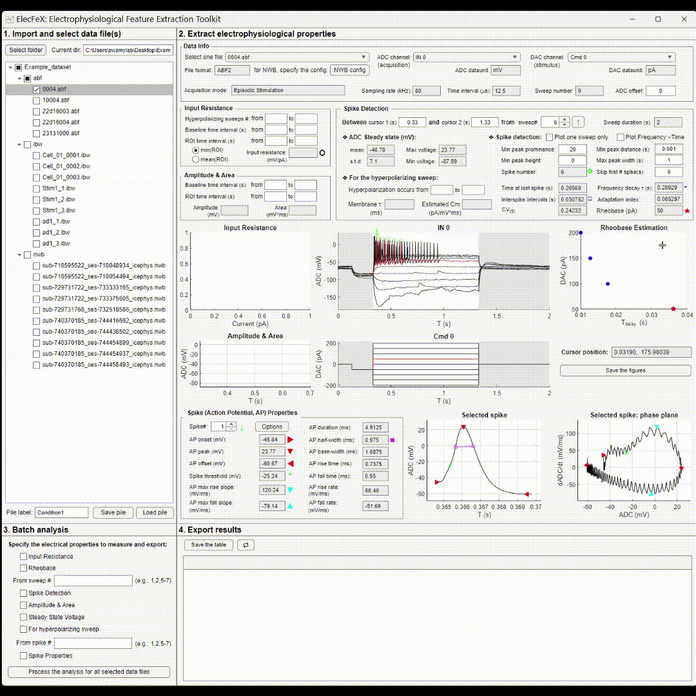

## 2.5 Spike Properties

**Measurement.** The properties of single spike specified by the “Spike#” spinner box.

**Setting.** To measure the spike properties, you need to specify:

1. **Spike#.** It specifies which spike to be measured. The selected spike is also marked by green down-arrow in the visualization panel.

2. **Options.** This button will open an window for [advanced settings](#251-advanced-setting) of the spike properties.

**Spike properties.** ElecFeX provides many customizable measurements on the spike shape, including:

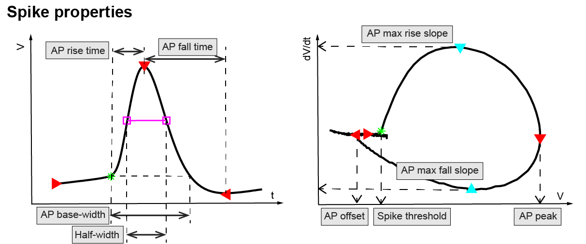

1. **AP onset (mV).** The local minimal voltage before the peak occurs. The AP onset is marked as red rightward triangle  in the visualization panel.

2. **AP peak (mV).** The maximal voltage reached during the action potential. The AP peak is marked as red downward triangle in the visualization panel.

3. **AP offset (mV)**. The local minimal voltage after the AP peak. The AP offset is marked as red leftward triangle in the visualization panel.

4. **Spike threshold (mV).** Spike threshold is defined as the voltage at which the neuron initiates a spike, yet its measurement can vary among different labs. Here provides six ways of quantifying spike threshold, adopted from Sekerli, et. al., 2004[5](#Reference) . See [Advanced Options](#251-advanced-setting) for detailed descriptions for each method. You can click the “Option” button and open the [Advanced Options](#251-advanced-setting) window for the setting of spike threshold measurement. The spike threshold is marked as green asterisk in the visualization panel.

5. **AP max rise slope (mV/ms)**. The maximal rate of rise of membrane voltage during spike rising phase. The AP max rise slope is marked as cyan downward triangle in the visualization panel.

6. **AP max fall slope (mV/ms).** The maximal rate of fall of membrane voltage during spike falling phase. The AP max fall slope is marked as cyan upward triangle in the visualization panel.

7. **AP duration (ms).** The time of the voltage between AP onset and AP offset.

8. **AP half-width (ms).** The time of the membrane voltage halfway between the AP peak and the spike threshold (default). The AP onset is marked as magenta squares in the visualization panel. The lower point of the half-width can also be customized as "AP onset" and "AP offset" in the [Advanced Options](#251-advanced-setting) window.

9. **AP base-width (ms).** The time of the voltage above the threshold level of the spike.

10. **AP rise time (ms).** The time of depolarization from the spike threshold to AP peak. You can specify the percentage of the time range (i,e., **10-90 rise time**) by clicking “Options” button and open the [Advanced Options](#251-advanced-setting) window for the setting of AP rise time measurement. 

11. **AP fall time (ms).** Time of repolarization from the AP peak to the spike threshold crossing. You can specify the percentage of the time range (i,e., **10-90 fall time**) by clicking “Options” button and open the [Advanced Options](#251-advanced-setting) window for the setting of AP fall time measurement. 

12. **AP rise rate (mV/ms).** The average voltage change rate during the rising phase of the action potential. 
    $$AP \ rise \ rate =\frac{AP \ peak- AP \ onset}{AP \ rise \ time}$$

13. **AP fall rate (mV/ms).** The average voltage change rate during the falling phase of the action potential.

    $$AP \ fall \ rate =\frac{AP \ offset - AP \ peak}{AP \ fall \ time}$$

### 2.5.1 Advanced setting.

Click the `Options` button in the spike properties panel and this “advanced setting" window will open. This window is to modify the measurements on multiple spike properties. 

2.5.1.1 [Spike threshold measurement methods](#2511-spike-threshold-measurement-methods) 
2.5.1.2 [Low-pass filter](#2512-low-pass-filter) 
2.5.1.1 [Half-width](#2513-half-width) 
2.5.1.1 [AP rise time and AP fall time](#2514-ap-rise-time-and-ap-fall-time) 

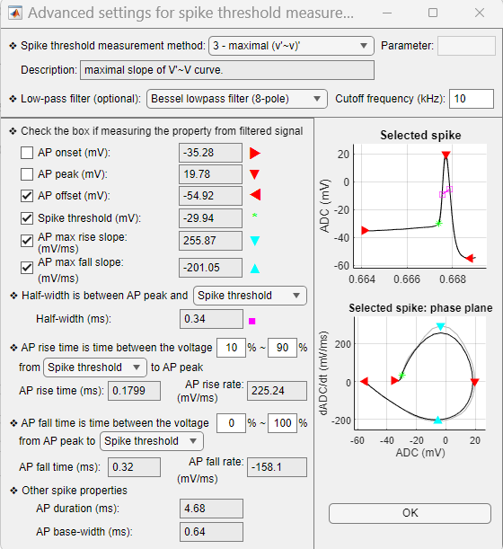

#### 2.5.1.1 Spike threshold measurement methods

Spike threshold is defined as the voltage at which the neuron initiates a spike. ElecFeX provides six commonly accepted way of quantifying the spike threshold, some of which are adopted from Sekerli, et. al., 2004[5](#Reference). These methods are:

1. **v'~v baseline deviation.** This method measure the spike threshold as the voltage where the time derivative of the voltage (V’) is at a <code>multiple</code> of the standard deviation of the baseline voltage. The baseline voltage is the voltage before the spike peak where its V’ is smaller than the 10% of the V’ values at the AP rising phase. You can change the value of the <code>multiple</code> by typing in the `Parameter` white textbox. The default value of the <code>multiple</code> is 3.

2. **v'~v maximal deviation.** This method measure the spike threshold as the voltage where the time derivative of the voltage (V'‘') is at a <code>multiple</code>% of the maximal V'.

3. **v'>=*ad hoc* value.** This method measure the spike threshold as the voltage where V’ is equal or larger than an *ad hoc* value. You can change the value of the `ad hoc value` by typing in the `Parameter` white textbox. The default value of the `multiple` is 5.

4. **maximal (v'~v)'.** This method measure the spike threshold as the voltage where the slope of the V’~V curve maximizes. 

5. **maximal (v'~v)''.** This method measure the spike threshold as the voltage where the second derivative of the V’~V curve maximizes. 

6. **inflection point.** This method measure the spike threshold as the voltage where the V' equals 0. 

7. **max curvature.** This method measure the spike threshold as the voltage where the curvature of the voltage $K_p=\frac{V''}{(1+(V')^2)^{3/2}}$ maximizes. 

   

#### 2.5.1.2 Low-pass filter

You can optionally choose to apply a low-pass filter to the signal and set the cutoff frequency in the `Cutoff frequency (Hz)` white textbox. Options include (1) Bessel lowpass filter (8-pole), (2) Boxcar smoothing filter (8-pole), (3) Butterworth lowpass filter (8-pole), (4) Chebyshev lowpass filter (8-pole), and (5) Gaussian lowpass filter. 

You can also specify whether a electrical property is measured from the filtered signal by clicking the checkboxes.

#### 2.5.1.3 Half-width

The half-width is measured as the time interval of voltage value the half way between the AP peak and (1) spike threshold, (2) AP onset, (3) AP offset.

#### 2.5.1.4 AP rise time and AP fall time

The AP rise time starts from either the AP onset or the spike threshold. 

The AP fall time ends at either the AP offset or the voltage at the falling phase which value equals the spike threshold. 

Type in the white textboxes to specify the percentage range. 

## 2.6 Visualization

The electrical properties are marked in the signals. You can get a direct impression on the measurement result, tuning the parameter settings that best-fit your data.

**Mouse position.** When navigating your mouse in each plot, the coordinate of the mouse within the axis will be displayed in the `Mouse position:` textbox. 

**Cursor position.** If there is any curve in the axis，click the mouse left key and a gray cross cursors will navigate the curve. The coordinate on the curve will be displayed in the `Cursor position:` textbox. The gray cross cursors can help you find the coordinate of the signal.

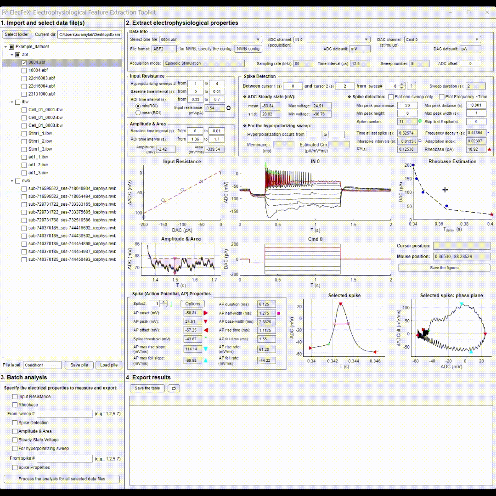

---

Next: [3. Batch analysis](batch_analysis.md)

# Reference

[1] Gu N, Vervaeke K, Hu H, Storm JF (2005) Kv7/KCNQ/M and HCN/h, but not KCa2/SK channels, contribute to the somatic medium after-hyperpolarization and excitability control in CA1 hippocampal pyramidal cells. J Physiol 566:689–715.

[2] Storm JF (1989) An after-hyperpolarization of medium duration in rat hippocampal pyramidal cells. J Physiol 409:171–190.

[3] Ma X, Miraucourt LS, Qiu H, Sharif-Naeini R, Khadra A (2023) Modulation of SK Channels via Calcium Buffering Tunes Intrinsic Excitability of Parvalbumin Interneurons in Neuropathic Pain: A Computational and Experimental Investigation. J Neurosci 43:5608–5622.

[4] Vogalis F, Harvey JR, Furness JB (2003) PKA-mediated inhibition of a novel K+ channel underlies the slow after-hyperpolarization in enteric AH neurons. J Physiol 548:801–814.

[5] Sekerli M, Del Negro CA, Lee RH, Butera RJ (2004) Estimating action potential thresholds from neuronal time-series: new metrics and evaluation of methodologies. IEEE Trans Biomed Eng 51:1665–1672.

