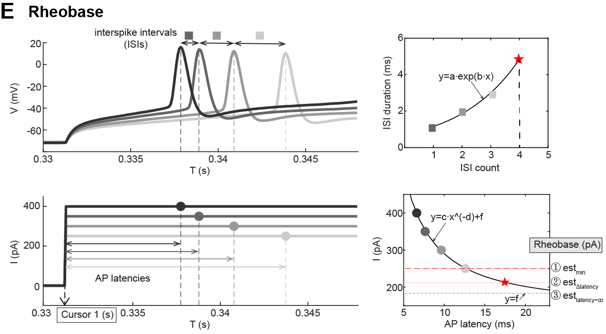

# 2. Extract electrophysiological properties

This tutorial will guide you through the measurements on all the electrical properties that ElecFeX provides. 

In the “extract electrophysiological properties” panel, you can load, process, and visualize your recordings from the selected files in a file-by-file manner. This is achieved in the very first subpanel:

1. [Data Info](#21-Data-Info) 

You can load a file by dropping down the box next to the text “Select one file from the pile” and its information, feature measurements, and visualization will be displayed/updated simultaneously. 

The measurement methods are split into four subpanels:

2. [Input Resistance](#22-Input-Resistance)

3. [Amplitude & Area](#23-Amplitude--Area)

4. [Spike Detection](#24-Spike-Detection)
5. [Spike Properties](#25-Spike-Properties)

You can change the values in the white textboxes so that the measurements suits your needs for data analysis. 

The definition for each electrical properties appeals when you move the cursor upon the text in ElecFeX and a tip textbox will appear. A detailed description of measurement methods for all the electrical properties are presented below. The measurement results are displayed in the gray textboxes (which are not editable by the users). The measurement results from each panel are also visualized in the plots.  

The electrical properties together with the signals are also visualized in separate plots.

6. [Visualization](#26-Visualization)

---

## 2.1. Data Info

1. **”Select one file from the pile” dropdown box.** Select one file from the file pile
2. **“ADC channel” and “DAC channel” dropdown box.** Select the channels for analog-to-digital converter (ADC) and digital-to-analog converter (DAC) signals. 
   + The ADC channels are the signals recorded from the cells and the DAC channels are the signal output applied to the cells. For the current clamp recordings, the ADC channels are the recorded voltage response and the DAC channels are the applied current stimuli.
   + ***ABF files.*** The name of “ADC channel” and “DAC channel” is consistent to the protocol settings of ABF files. 
   + ***NWB files.*** Both the ADC and DAC channel display the name of the stimulus protocols. The ADC channel loads data from the “acquisition” and the DAC channel loads data from the “stimulus”.
   + ***IBW files***. Both the ADC and DAC channels display the name of the file and load the same data (either voltage response or current stimulus) from the same file.
3. **ADC correction.** Correct the value of signal of ADC channel by adding up the typed-in value. One example scenario to perform voltage correction is to correct the liquid junction potential or the offset voltage of the pipette.

After the above settings, the basic information about the file and the recordings are displayed in the grey textboxes:

1. **File format.** It displays the data file format and its version. The current version of ElecFeX can specifically load the 1st and 2nd version of **Axon Binary File (ABF) format (ABF)** from pClamp data acquisition program, the **Igor Binary Wave (IBW)** from Igor Pro, and the **Neurodata Without Border (NWB)**.
2. **Acquisition Mode.** The data acquisition mode of the data files.
   + ***ABF files.*** The acquisition mode set in the protocol, including (1) Event-driven, variable length, (2) Event-driven, fixed length, (3) Gap-free, (4) High Speed Oscilloscope, (5) Episodic Stimulation. For a detailed description on each acquisition mode, please refer to [pClamp User Guide][https://neurophysics.ucsd.edu/Manuals/Axon%20Instruments/pCLAMP10-User-Guide-RevA.pdf].
   + ***IBW files.*** The same name as displayed in the ADC and DAC channels
   + ***NWB files.*** The attributes of the “stimulus”. For instance, “VoltageClampSeries” or “CurrentClampSeries”.
3. **Sampling rate (kHz).** The data acquisition sampling rate.
4. **Time interval ($\mu$s).** The time interval of sampling data. It is the inverse of sampling rate.
5. **Sweep number.** The total number of sweep(s).

## 2.2. Input Resistance

**Measurement.** This subpanel is to measure the slope of a linear fitted curve of DAC signals against ADC signals which are within restraint time intervals. This method will fit $(x,y)=(DAC_{ROI}-DAC_{baseline}, ADC_{ROI}-ADC_{baseline})$ to a linear function $y=ax+b$ by MATLAB built-in function `polyfit()`. The value of fitted slope $a$ is estimated as the input resistance ($R_m$) displayed in “Input resistance” gray textbox. If the baseline is NOT specified, $(DAC_{baseline},ADC_{baseline}) = (0,0)$. Given that fitting requires at least two datapoints, if the baseline is specified, at least one sweep is required to be specified; otherwise, at least two sweeps are required to be specified.

**Input resistance.** One example to use this method is the measurement on input resistance. When the DAC signals are the hyperpolarizing current stimuli and the ADC signals are the voltage response, the value of the slope corresponds to the “input resistance”. Input resistance provides a readout of the pipette seal quality and overall conducting channels at the neuron membrane surface. It describes how much the membrane potential depolarizes in response to a step current. 

**Setting.** To measure the input resistance, you need to specify the parameter settings in the white textboxes as introduced below:

1. **Hyperpolarizing sweep#.** It specifies that the ADC and DAC signals are sampled from the [left box] sweep to the [right box] sweep. 
   The values of the two boxes must follows: (1) [left box] and [right box] are positive integer, and (2) [left box] must be smaller than or equal to [right box]. 
2. **Baseline time interval (s)**. It specifies the time interval of the baseline (or offset) ADC and DAC signals, which will be corrected from the ROI values. These two boxes are optional to set. If specified, the baseline value is the average in-between the specified baseline time interval; otherwise, the default baseline value is 0. 
   The values of the two boxes must follows (1) [left box] and [right box] are in the range between 0 and the duration of the sweep, (2) [left box] must be smaller than or equal to [right box].
3. **ROI time interval (s)**. It specifies the time interval of ADC and DAC signals to perform the linear fitting. The ROI value is the average ADC and DAC signal and in-between the specified ROI time interval.
   The values of the two boxes must follows (1) [left box] and [right box] are in the range between 0 and the duration of the sweep, (2) [left box] must be smaller than or equal to [right box].

## 2.3. Amplitude & Area

**Measurement.** This subpanel is to measure the amplitude and area of ADC signal of the specified sweep (“Sweep #” spinner box) in-between the time interval specified by “ROI time interval (s)”.

**Amplitude & Area.** There are many electrophysiological features quantified by their amplitude and area, such as voltage sag and after-hyperpolarization potential (AHP). The ***voltage sag*** measures the voltage difference between the peak hyperpolarization and the resting potential when injecting a hyperpolarizing current, and it is used as an indicator of hyperpolarization-activated cation current $I_h$. The ***AHP*** measures the voltage difference between the hyperpolarization and the resting potential following spiking. AHP are classified into slow, medium, and fast based on their time decay rate [1,2,3](#Reference) and are associated with the activity of varied ion channels, such as the calcium-activated potassium channels[4](#Reference).

**Setting.** To measure the input resistance, you need to specify the parameter settings in the white textboxes as introduced below:

1. **Baseline time interval (s)**. It specifies the time interval of the baseline (or offset) ADC signal to be removed from the ROI signal. These two boxes are optional to set. If specified, the baseline value is the average in between the specified baseline time interval; otherwise, the default baseline value is 0. The values of the two boxes must follows (1) [left box] and [right box] are in the range between 0 and the duration of the sweep, (2) [left box] must be smaller than or equal to [right box].

2. **ROI time interval (s)**. It specifies the time interval of ADC signal to measure the amplitude and area. The ROI signal is in between the specified ROI time interval. The values of the two boxes must follows (1) [left box] and [right box] are in the range between 0 and the duration of the sweep, (2) [left box] must be smaller than or equal to [right box].

   

## 2.4. Spike Detection

**Measurement.** This subpanel quantify the data within the restraint time interval of ADC signal and composes three parts:

[2.4.1 Steady state voltage](#241-Steady-state-voltage)

[2.4.2 For hyperpolarizing sweep](#242-For-hyperpolarizing-sweep)

[2.4.3 Spike detection](#243-Spike-Detection)

**Setting. ** To measure all these three parts of the electrical properties above, you need to specify the parameter settings in the white textboxes as introduced below:

1. **Cursor 1 (s) and Cursor 2 (s)**. It specifies the time interval of the ADC signal to perform the measurements. The values of the two boxes must follows (1) [left box] and [right box] are in the range between 0 and the duration of the sweep, (2) [left box] must be smaller than or equal to [right box]. The signals outside the specified time regions are covered in gray.
2. **Sweep #**. It specify the specific sweep of the ADC signal to perform the measurements. The ADC and DAC signal of specified sweep is plotted in red in the visualization panel and the other sweeps are in black.
3. **Upward/downward arrow button**. This button is to flip up the order of the sweep. The upward arrow button is the same sequence as in the data file and the downward arrow button is the opposite.

### 2.4.1 Steady state voltage

**Measurement. ** This part measures quantify the (1) mean, (2) standard deviation (s.t.d.), (3) max, and (4) min value of the ADC signal in between the time interval specified by “Cursor 1 (s)” and “Cursor 2 (s)” white textboxes. This method can be used to measure the ***resting membrane potential*** when there is no current injection.

**Setting.** To measure the values for the “steady state voltage” part, all the parameter settings are introduced/completed in the beginning of the panel [2.4. Spike detection](#24-Spike-Detection).

### 2.4.2 For hyperpolarizing sweep

**Measurement.** This part estimate the membrane constant and the membrane capacitance from the sweeps in response to hyperpolarizing current. This method fit the specified ADC signals to a single exponential equation $y=a\cdot exp(x/\tau)$ where the exponential decay constant was estimated as the ***membrane time constant ($\tau$)***.  If the input resistance $R_m$ is set and measured in the panel [2.2. Input Resistance](#22-Input-Resistance), the ***membrane capacitance*** $C_m$ is estimated as $C_m=\frac{\tau}{R_m}$.

**Setting. ** To measure the membrane constant and capacitance, you need to specify the parameter settings in the white textboxes as introduced below:

1. **Time interval (s). **It specifies the time interval of the ADC signal from where the voltage *starts to hyperpolarize* to where the voltage reaches the *steady state*. The values of the two boxes must follows (1) [left box] and [right box] are in the range between 0 and the duration of the sweep, (2) [left box] must be smaller than or equal to [right box].

### 2.4.3 Spike detection

**Measurement. **This subpanel is to detect the spikes from the restraint time interval of ADC channels and quantify the time series of the spike train. 

**Setting.** The spike detection step in ElecFeX relies on the MATLAB built-in function `findpeaks()` from the *Signal Processing Toolbox*. The definitions of the parameters are consistent to those described in this [document](https://www.mathworks.com/help/signal/ref/findpeaks.html) of `findpeaks()`. To be specific, you need to specify the parameter settings in the white textboxes and checkboxes as introduced below:

1. **Min peak prominence (mV).** It specified the minimal value for the peak prominence. The peak prominence refers to the peak amplitude relatives to its local minimal. For details: [`findpeaks()`-Prominence](https://www.mathworks.com/help/signal/ref/findpeaks.html#buff2uu)
2. **Min peak height (mV)**. It specifies the minimal value for spike height (i.e., the value of the spike peak).
3. **Min peak distance (s).** When you specify a value for 'Min peak distance', the algorithm chooses the tallest peak in the signal and ignores all peaks within 'Min peak distance' of it. The function then repeats the procedure for the tallest remaining peak and iterates until it runs out of peaks to consider.
4. **Max peak width (s)**. It specifies the maximal widths of spikes.
5. **Plot one sweep only checkbox**. If checked, only the sweep specified by “Sweep #” spinner box will be plotted while signals of other sweeps are hidden.
6. **Plot Frequency (Hz) v.s. Time (s) checkbox**. If checked, instantaneous firing frequencies and their single exponential fitting curve is plotted in the visualization. This checkbox is only accessible when more than 3 spikes are detected.

**The time series of spike trains. ** The detected spikes are marked as green circles and are quantified by the properties below:

1. **Spike number.** The total number of detected spike(s) between cursor 1 and cursor 2.
2. **Time at last spike (s).** The time difference between the “Cursor 1 (s)” textbox and the timepoint at the last spike peak. It can be used to measure ***discharge duration***.
3. **Interspike intervals (s).** The list of time interval(s) between every two adjacent spikes.
4. **CVISI**. It measures the standard deviation of interspike intervals (ISIs) divided by the mean ISI. This value describes the variance in ISI.
5. **Frequency decay rate**. It measures the time constant when the instantaneous firing frequencies are fitted to a single exponential decay function $f=a\cdot exp(t/\tau)$.
6. **Adaptation Index**. The normalized average difference of two consecutive interspike intervals. 
   $$adaptation\ index = \sum_i \frac{ISI_{i+1}-ISI_{i}}{ISI_{i+1}+ISI_{i}}$$

### 2.4.4 Rheobase

**Measurement.** Rheobase is the minimal step current that is injected for an infinite time and evokes a single action potential. However, since the computational model of the neuron is not usually available, and that it is impractical to test an infinite current injection, we decided to infer a close approximate by using the delays to the first spikes for each of the step current values applied to predict the delay to a virtual spike which would be evoked on the infraliminal step current injection. This method guarantees a consistent and standardized estimation of the rheobase, regardless of the specific step-current protocol employed. 

Rheobase was estimated as follows: the time difference between the first spikes of each adjacent current steps were plotted against the sweep number and was fitted to a single exponential function. From this fitted exponential curve, the time delay of the first spike of the next smaller current step, i.e., the estimated rheobase step, was obtained. The value of the estimated rheobase step was then derived from the curve of a power function fitted to the plot of time latencies of the first spikes against their step currents.

**Setting. ** To measure the rheobase, you need to specify the parameter settings in the part [2.4.3 Spike Detection](#243-Spike-Detection).

## 2.5. Spike Properties

**Measurement. ** This subpanel is to measure the properties of the single spike specified in the “Spike #” spinner box.

**Setting. **To measure the spike properties, you need to specify the parameter settings below:

1. **Spike #.** It specifies which spike to be measured. The selected spike is also marked by green down-arrow in the visualization panel.

**Spike properties.** ElecFeX provides a detailed description on the spike shape, including the properties below:

1. **AP onset (mV). ** The local minimal voltage before the peak occurs. The AP onset is marked as red rightward triangle in the visualization panel.

2. **AP peak (mV).** The maximal voltage reached during the action potential. The AP peak is marked as red downward triangle in the visualization panel.

3. **AP offset(mV)**. The local minimal voltage after the AP peak. The AP offset is marked as red left triangle in the visualization panel.

4. **AP max rise slope (mV/ms)**. The maximal rate of rise of membrane voltage during spike rising phase. The AP max rise slope is marked as cyan downward triangle in the visualization panel.

5. **AP max fall slope (mV/ms).** The maximal rate of fall of membrane voltage during spike falling phase. The AP max fall slope is marked as cyan upward triangle in the visualization panel.

6. **Spike threshold (mV).** Spike threshold is defined as the voltage at which the neuron initiates a spike, yet its measurement is varied among different labs. Here provides six ways of quantifying spike threshold adopted from Sekerli, et. al., 2004 [5](#Reference) . See [Advanced Options](#251-Advanced-options) for detailed descriptions for each method. You can click the “Option” button and open the [Advanced Options](#251-Advanced-options) window for the setting of spike threshold measurement. The spike threshold is marked as green asterisk in the visualization panel.

7. **AP duration (ms).** The time of the voltage between AP onset and AP offset.

8. **AP half-width (ms).** The time of the membrane voltage halfway between the spike threshold and the AP peak. The AP onset is marked as magenta squares in the visualization panel.

9. **AP base-width (ms).** The time of the voltage above the threshold level of the spike.

10. **AP rise time (ms).** The time of depolarization from the spike threshold to AP peak. You can specify the percentage of the time range (i,e., 10-90 rise time) by clicking “Options” button and open the [Advanced Options](#251-Advanced-options) window for the setting of AP rise time measurement. 

11. **AP rise rate (mV/ms).** The average voltage change rate during the rising phase of the action potential. 
    $$AP \ rise \ rate =\frac{AP \ peak- AP \ onset}{AP \ rise \ time}$$

12. **AP fall time (ms).** Time of repolarization from the AP peak to the spike threshold crossing. You can specify the percentage of the time range (i,e., 10-90 fall time) by clicking “Options” button and open the [Advanced Options](#251-Advanced-options) window for the setting of AP fall time measurement. 

13. **AP fall rate (mV/ms).** The average voltage change rate during the falling phase of the action potential.

    $$AP \ fall \ rate =\frac{AP \ offset - AP \ peak}{AP \ fall \ time}$$

### 2.5.1. Advanced options.

This “advanced options” window is opened when clicking the “Options” button. This windows contains the settings for multiple spike properties. 

#### 2.5.1.1. Spike threshold measurement methods

Spike threshold is defined as the voltage at which the neuron initiates a spike. ElecFeX provides six commonly accepted way of quantifying the spike threshold, some of which are adopted from Sekerli, et. al., 2004 [5](#Reference). This methods are:

1. **v‘~v baseline deviation. ** This method measure the spike threshold as the voltage where the time derivative of the voltage (V’) is equal or larger than a [multiple] of the standard deviation of the baseline voltage. The baseline voltage is the voltage before the spike peak where its V’ is smaller than the 10% of the V’ values at the AP rising phase. You can change the value of the [multiple] by typing in the “Parameter” white textbox. The default value of the [multiple] is 3.

2. **v’>=*ad hoc* value. **This method measure the spike threshold as the voltage where V’ is equal or larger than an [*ad hoc* value]. You can change the value of the [*ad hoc* value] by typing in the “Parameter” white textbox. The default value of the [multiple] is 5 mV/ms.

3. **maximal (v’~v)’.** This method measure the spike threshold as the voltage where the slope of the V’~V curve maximizes. 

4. **maximal (v’~v)’‘.** This method measure the spike threshold as the voltage where the second derivative of the V’~V curve maximizes. 

5. **inflection point. ** This method measure the spike threshold as the voltage where the V’ equals 0. 

6. **max curvature.** This method measure the spike threshold as the voltage where the curvature of the voltage $K_p=\frac{V''}{(1+(V')^2)^{3/2}}$ maximizes. 

   

#### 2.5.1.2 Low-pass filter

You can optionally choose to apply a low-pass filter to the signal and set the cutoff frequency in the “Cutoff frequency (Hz)” white textbox. Options include (1) Bessel lowpass filter (8-pole), (2) Boxcar smoothing filter (8-pole), (3) Butterworth lowpass filter (8-pole), (4) Chebyshev lowpass filter (8-pole), and (5) Gaussian lowpass filter. 

You can specify which electrical properties are measured from the filtered signals and which are not by clicking the checkboxes.

#### 2.5.1.3 AP rise time and AP fall time

In this part, you can modify the definition of the AP rise time and AP fall time. The AP rise time starts from either the AP onset or the spike threshold. The AP fall time ends at either the AP offset or the voltage at the falling phase which value equals the spike threshold. You can also type in the white textboxes to specify the range percentage. 

## 2.6 Visualization

The measured electrical properties are marked upon the loaded signals so the users have a direct knowledge of their measurements.

**Cursor position. **When navigating your cursor in each plot, the coordinate of the cursor within the axis will be displayed in the “Cursor position:” gray textbox. By clicking the left key of the mouse, a horizontal and vertical gray line will appear. These lines can help you find the coordinate location of the signal.

Currently, you cannot zoom in/out each plot. 

# Reference

[1] Gu N, Vervaeke K, Hu H, Storm JF (2005) Kv7/KCNQ/M and HCN/h, but not KCa2/SK channels, contribute to the somatic medium after-hyperpolarization and excitability control in CA1 hippocampal pyramidal cells. J Physiol 566:689–715.

[2] Storm JF (1989) An after-hyperpolarization of medium duration in rat hippocampal pyramidal cells. J Physiol 409:171–190.

[3] Ma X, Miraucourt LS, Qiu H, Sharif-Naeini R, Khadra A (2023) Modulation of SK Channels via Calcium Buffering Tunes Intrinsic Excitability of Parvalbumin Interneurons in Neuropathic Pain: A Computational and Experimental Investigation. J Neurosci 43:5608–5622.

[4] Vogalis F, Harvey JR, Furness JB (2003) PKA-mediated inhibition of a novel K+ channel underlies the slow after-hyperpolarization in enteric AH neurons. J Physiol 548:801–814.

[5] Sekerli M, Del Negro CA, Lee RH, Butera RJ (2004) Estimating action potential thresholds from neuronal time-series: new metrics and evaluation of methodologies. IEEE Trans Biomed Eng 51:1665–1672.

