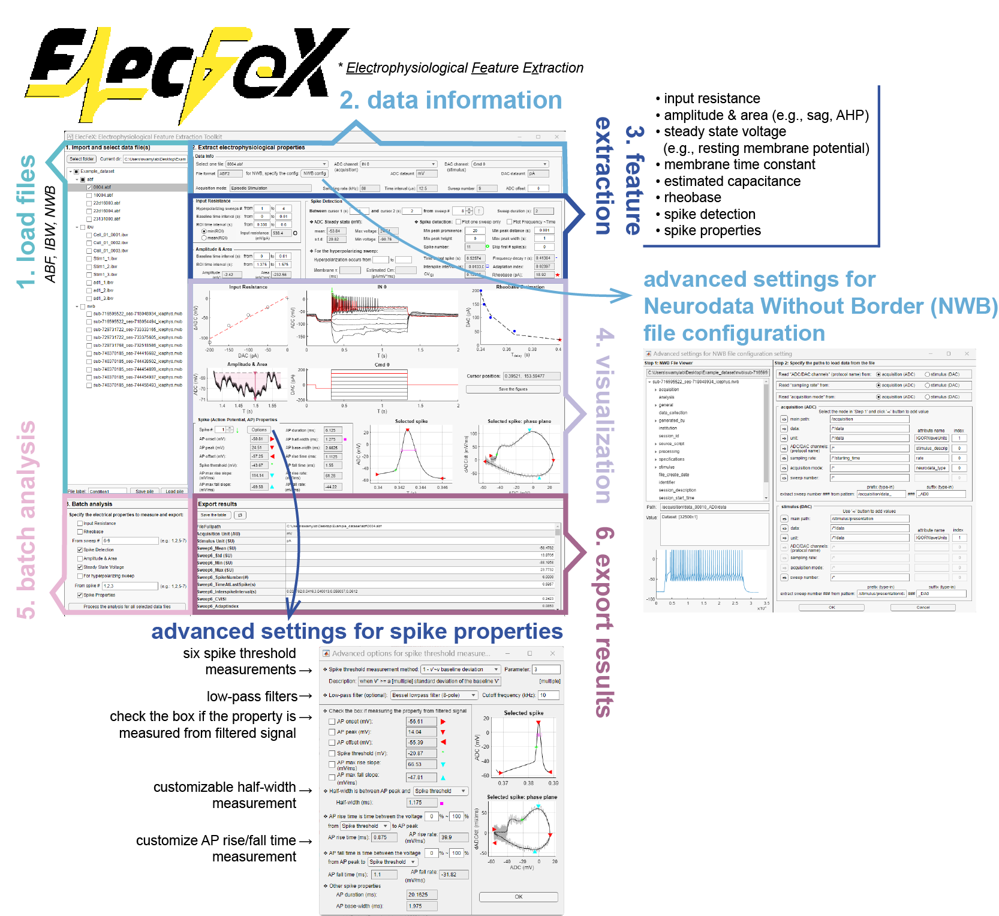
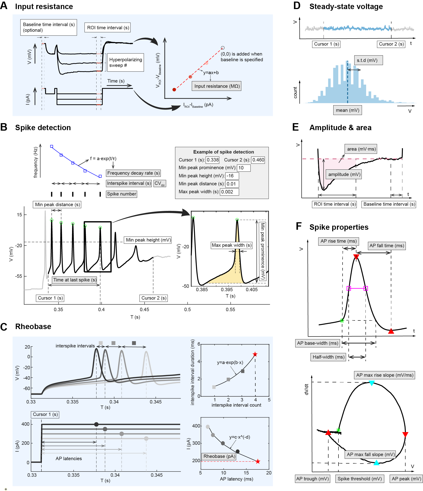

 

# What is ElecFeX?

ElecFeX is a MATLAB-based <u>**Elec**</u>trophysiological <u>**Fe**</u>ature e<u>**X**</u>traction toolkit for current-clamp recordings. This software was designed to analyze electrophysiological recordings in an intuitive and efficient way so as to be accessible to everyone no matter their level of expertise. This repository provides detailed instructions on the installation and usage of the toolkit.

- [Installation](#Installation)

- [Tutorials](#Tutorials)

  

#### The ElecFeX toolkit includes the following features:

- Running on MATLAB or stand-alone
- Graphical user interface (GUI)
- No programming required
- pClamp data file format (ABF) importing
- Customizable methods for a wide range of electrophysiological features
- Multiple file processing
- Formatted output for further analysis such as statistical analysis and clustering
- Interactive visualization 

#### An overview of ElecFeX’s graphical user interface:

The graphical user interface (GUI) of ElecFeX is designed to be user-friendly with texts that guide the user through the complete feature extraction workflow. The main GUI window encompasses all the essential elements required for the analysis process, and there is another callable window for advanced settings related to measuring spike properties. The main window of GUI is organized in accordance with the analysis procedures and is divided into six sections including (1) load file, (2) data info, (3) feature extraction, (4) visualization, (5) batch analysis setting, and (6) export results. Detailed instructions regarding installation and implementation of the toolkit can be found on the corresponding GitHub page.

#### A summary of customizable methods for six categories of electrophysiological features:

ElecFeX provides a collection of methods to extract commonly studied electrophysiological features. These methods are equipped with customizable parameters (indicated as white box texts in Figure 3), allowing for flexibility in processing signals with various waveforms. 

If you use ElecFeX, please cite the following publication:

>Ma, Xinyue, et al. "ElecFeX: A user-friendly and efficient toolkit for feature extraction from electrophysiological data" *bioRxiv* (2023): 2023-05. 

In the paper, you can find a neuroscientist-oriented introduction of the toolkit and some examples of using ElecFeX to distinguish neuronal subgroups across nervous systems and across species.

The current version of ElecFeX GUI is not perfect and we’ll keep updating it. We encourage everyone who found this GUI is right for you or even interest to contribute to this tool, to provide your feedback in our GitHub page and help the development of ElecFeX.

---
Author: Xinyue Ma  
Email: xinyue.ma@mail.mcgill.ca  
Integrated Program in Neuroscience  
McGill University  
Montreal, QC, H3A 1A1  
Canada  

Special thanks to all the lab members in Anmar Khadra’s lab (https://www.medicine.mcgill.ca/physio/khadralab/) and Reza Sharif-Naeini’s lab (https://www.shariflab.org/) for their test and comments for the development of the toolkit 

Logo: Xinyue Ma, 2023

----

# I. Installation

**Platform compatibility**: windows, macOS, Linux

We provided two options to install ElecFeX given the accessibility of a licensed MATLAB:

- Add-on package to MATLAB (must have a licensed copy of MATLAB installed): If you have installed or have access to a licensed MATLAB in your system, you can install ElecFeX as an add-on toolbox into MATLAB. MATLAB R2022a is recommended for the toolbox to achieve the best performance.

- Standalone desktop application. 

  

### To install as an add-on package

**Requirements**: MATLAB R2022a (recommended version), Signal Processing toolbox, Curve Fitting toolbox.

*If you don’t have MATLAB installed.* To install MATLAB R2022a, go to https://www.mathworks.com/downloads/, select and download release “R2022a”. Next, double-click on “setup.exe” and follow the installation steps. In the “PRODUCTS” selection window, check at least the “Signal Processing toolbox” and the “Curve Fitting toolbox”. 

*If you have installed MATLAB.* Check if the required toolboxes are installed. You can check them by:

- In the Command windows, type in *ver*, and it will display all the packages you have installed

OR

- In the Toolbar, go to “Home” panel and select “Add-ons”-“Manage Add-Ons” and it will display all the packages you have installed. 

*If the required toolboxes are not installed.* Go to “Home” panel and select “Add-ons”-“Get Add-ons” where you can search and install them.

After completing the above requirements, you can install ElecFeX as an add-on package into MATLAB.

**To install ElecFeX as an add-on package into MATLAB:**

1. Use the “Download ZIP” option to download the latest version from the Github page and unzip it to a local directory. 
2. Double-click on the “../Installation/AddIn/ElecFeX.mlappinstall” and a dialog window will appear.
3. Click “Install” in the opened dialog window and the “ElecFeX” is installed.
4. Once installed, open the app from the MATLAB Toolbars “Apps”, dropdown and under ‘MY APPS’ click “ElecFeX” and the GUI will appear.

### To install as a standalone desktop application

A standalone desktop application doesn’t require you to have MATLAB installed in your operating system. 

**To install ElecFeX as a standalone desktop application:**

1. Use the “Download ZIP” option to download the latest version from the Github page and unzip it to a local directory. 
2. Double-click on the “../Installation/Standalone/ElecFeXInstaller.exe” and follow the instruction to installs ElecFeX. 
3. Once installed, go to the file installed location and find “../application/ElecFeX.exe” to run the application.

# II. Tutorials

* [Loading electrophysiological data](tutorials/load_data.md)
* [Spike dectection](tutorials/spikes_detection.md)
* [Spike properties](tutorials/spike_properties.md)
* [Batch analysis](tutorials/batch_analysis.md)
* [Examples post-analysis of ElecFeX’s output](tutorials/postanalysis.md)