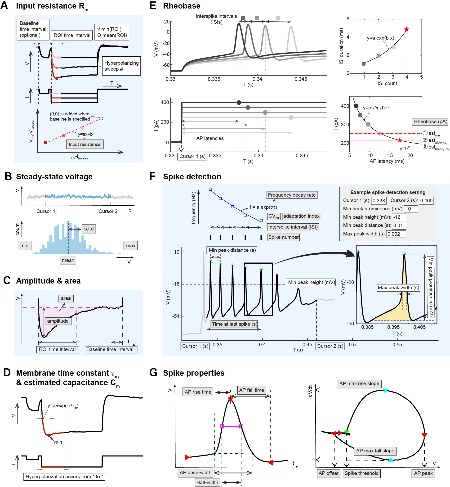

   

   

- [What is ElecFeX?](#What_is_ElecFeX?)
- [Installation](Installation/readme.md)
- [Tutorials](Tutorials/readme.md)
---

If you find ElecFeX helpful, buy the developer a cup of coffee :coffee:

.

---

# What is ElecFeX?

ElecFeX is a MATLAB-based <u>**Elec**</u>trophysiological <u>**Fe**</u>ature e<u>**X**</u>traction toolkit for current-clamp recordings. This software was designed to analyze electrophysiological recordings in an intuitive and efficient way so as to be accessible to everyone no matter their level of expertise. This repository provides detailed instructions on the installation and usage of the toolkit.

### The ElecFeX toolkit includes the following features:

- Graphical user interface (GUI)
- Running on MATLAB or stand-alone
- No coding/programming required
- Support multiple data formats including Axon Binary File format by pClamp (ABF), Igor Binary Wave format (IBW) by igor Pro, and Neurodata Without Borders (NWB)
- Customizable methods for a wide range of electrophysiological features
- Multiple file processing 
- Formatted output for further analysis such as statistical analysis and clustering
- Interactive visualization 

### An overview of ElecFeX’s graphical user interface:

The graphical user interface (GUI) of ElecFeX is designed to be user-friendly with texts that guide the users through the workflow of feature extraction. The main GUI window encompasses all the essential elements required for the analysis process, and there is a callable window for advanced settings for the measurements on spike properties. 

The main window of GUI is organized in accordance with the analysis procedures and is divided into four sections including (1) import and select data file(s), (2) extract electrophysiological properties, (3) Process selcted data file(s) (batch analysis), and (4) export data analysis results. Detailed instructions regarding installation and implementation of the toolkit can be found at the [Tutorials](Tutorials/readme.md) page.

### A summary of customizable methods for six categories of electrophysiological features:

ElecFeX provides a collection of methods to extract commonly studied electrophysiological features. These methods are equipped with customizable parameters (indicated as white box texts in the figure below), allowing for flexibility in processing signals with various waveforms. For a detailed definition on each electrical properties, see the [Tutorial](Tutorials/extract_feature.md) page and also the Methods section in the [preprint](https://www.biorxiv.org/content/10.1101/2023.05.27.542584v1).

### Credit

If you use ElecFeX, please cite the following publication:

>Ma, Xinyue, et al. "ElecFeX: A user-friendly and efficient toolkit for feature extraction from electrophysiological data" *bioRxiv* (2023): 2023-05. doi: https://www.biorxiv.org/content/10.1101/2023.05.27.542584v1

In the paper, you can find a neuroscientist-oriented introduction of the toolbox and some examples of using ElecFeX to identify neuronal subgroups from the datasets across different nervous systems, across species, and the large datasets from the [Allen Cell Types Database](https://doi.org/10.48324/dandi.000020/0.210913.1639).

The current version of ElecFeX GUI is not perfect and we’ll keep updating it. We encourage everyone who found this GUI is right for you or even interest to contribute to this tool, to provide your feedback in our GitHub page and help the development of ElecFeX.

---
Author: Xinyue Ma  
Email: xinyue.ma@mail.mcgill.ca  
Integrated Program in Neuroscience  
McGill University  
Montreal, QC, H3A 1A1  
Canada  

Special thanks to [Anmar Khadra’s lab](https://www.medicine.mcgill.ca/physio/khadralab/) and [Reza Sharif-Naeini’s lab](https://www.shariflab.org/) for testing the toolkit and providing valuable suggestions.

Logo: Xinyue Ma, 2023

----
